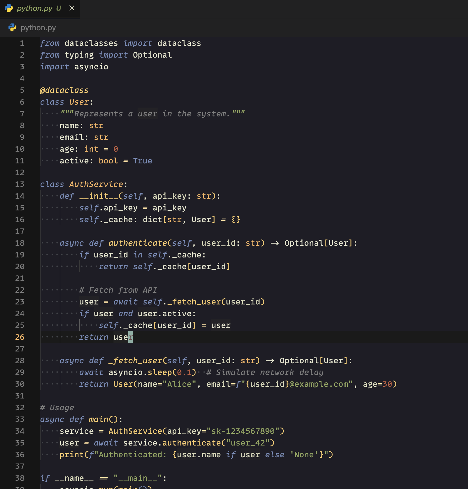
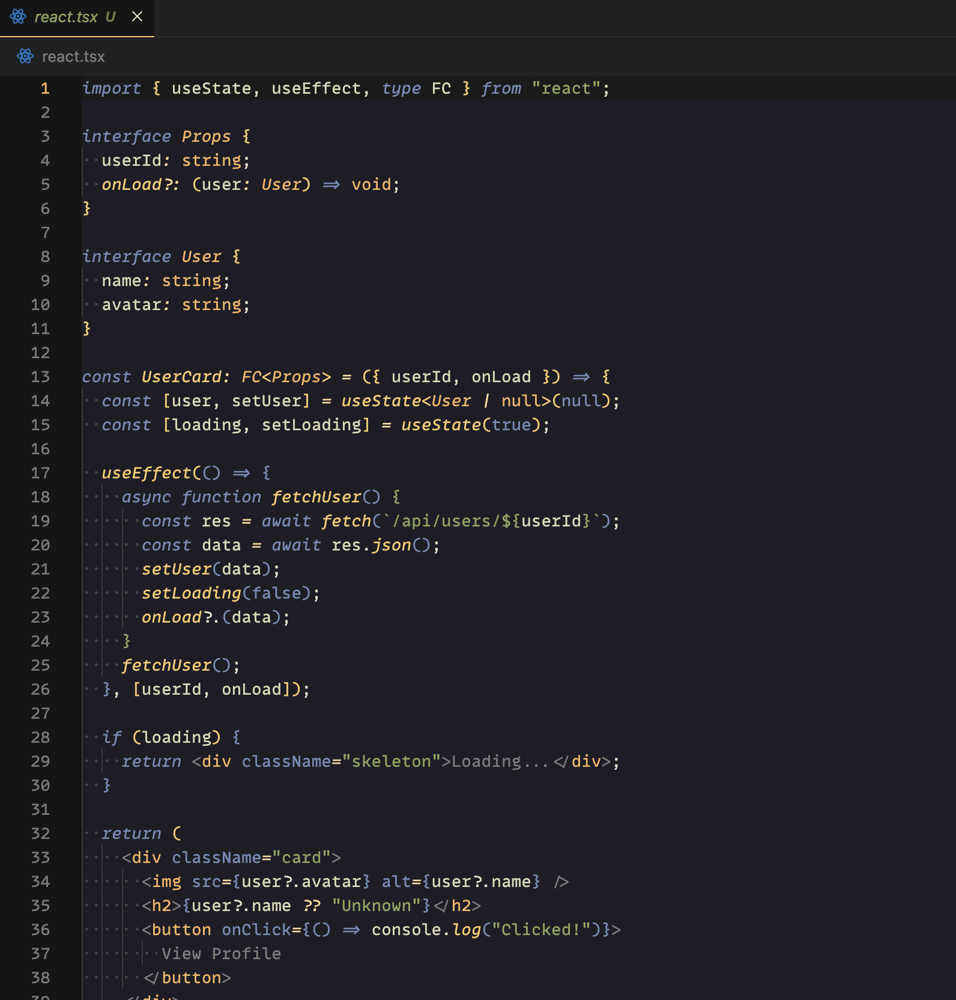
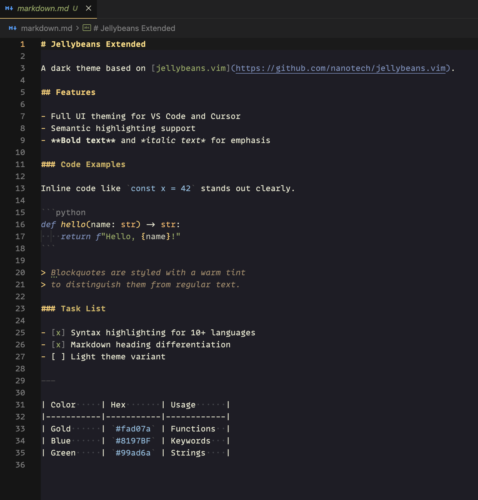
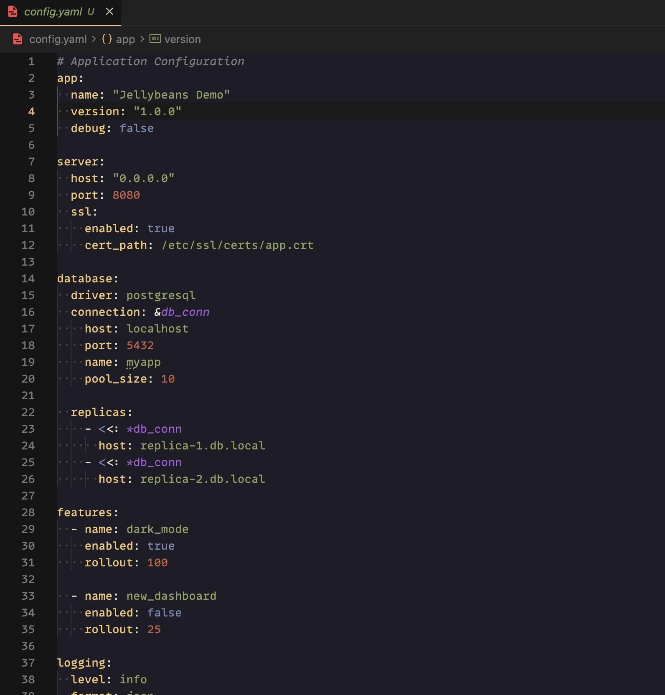

# Jellybeans Extended

A dark theme based on [jellybeans.vim](https://github.com/nanotech/jellybeans.vim) with extended UI coverage.

[](https://marketplace.visualstudio.com/items?itemName=YoonhoLee.jellybeans-extended)

## Installation

### Option 1: VS Code Marketplace (Recommended)

Install directly from the [VS Code Marketplace](https://marketplace.visualstudio.com/items?itemName=YoonhoLee.jellybeans-extended) or search "Jellybeans Extended" in the Extensions panel.

### Option 2: Install from VSIX

1. Download the latest `.vsix` file from [Releases](../../releases)
2. In VS Code/Cursor: `Cmd+Shift+P` → "Extensions: Install from VSIX..."
3. Select the downloaded `.vsix` file
4. Reload and select the theme: `Cmd+K Cmd+T` → "Jellybeans Extended"

### Option 3: Manual Installation

1. Clone this repo into your extensions folder:
   ```bash
   # VS Code
   git clone https://github.com/yoonholee/jellybeans-extended ~/.vscode/extensions/jellybeans-extended

   # Cursor
   git clone https://github.com/yoonholee/jellybeans-extended ~/.cursor/extensions/jellybeans-extended
   ```
2. Reload the editor
3. Select the theme: `Cmd+K Cmd+T` → "Jellybeans Extended"

### Option 4: Build VSIX Yourself

```bash
npm install -g @vscode/vsce
vsce package
# Generates jellybeans-extended-x.x.x.vsix
```

## Screenshots

### Python


### TypeScript


### React/TSX


### Markdown


### YAML


## Features

- Full UI theming (activity bar, sidebar, tabs, terminal, etc.)
- Semantic highlighting support
- Bracket pair colorization
- Differentiated markdown heading levels (h1/h2/h3+)
- Language support: JavaScript, TypeScript, Python, Rust, Go, HTML, CSS, JSON, YAML, LaTeX, and more

## Color Palette

| Element | Color |
|---------|-------|
| Background | `#151515` |
| Foreground | `#e8e8d3` |
| Keywords | `#8197BF` |
| Functions | `#fad07a` |
| Strings | `#99ad6a` |
| Numbers | `#cf6a4c` |
| Classes/Types | `#fabb6e` |
| Comments | `#888888` |

## Credits

Based on:
- [jellybeans.vim](https://github.com/nanotech/jellybeans.vim) by nanotech
- [jellybeans-theme](https://github.com/DNonov/jellybeans-theme) for VS Code by DNonov
